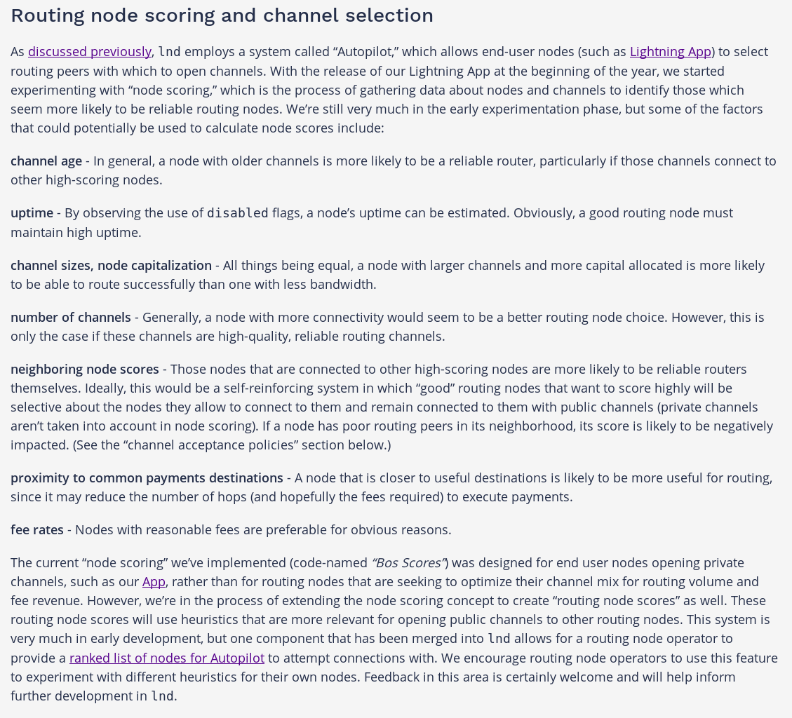
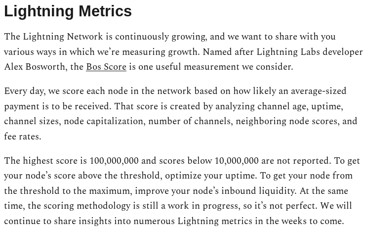

# Bos Score

Link to the Bos Score list:  
[https://nodes.lightning.computer/availability/v1/btc.json](https://nodes.lightning.computer/availability/v1/btc.json)

* updated daily
* nodes are displayed in alphabetical order according to the pubkey.

A sortable version:  
[https://lightningwiki.net/bos/](https://lightningwiki.net/bos/)

  
  

## Resources

Articles:  
[https://lightning.engineering/posts/2019-11-07-routing-guide-2/](https://lightning.engineering/posts/2019-11-07-routing-guide-2/)  
[https://lightninglabs.substack.com/p/its-lit-introducing-the-lightning](https://lightninglabs.substack.com/p/its-lit-introducing-the-lightning)

Videos:  
[https://twitter.com/lightning/status/1292898032430780429](https://twitter.com/lightning/status/1292898032430780429)

